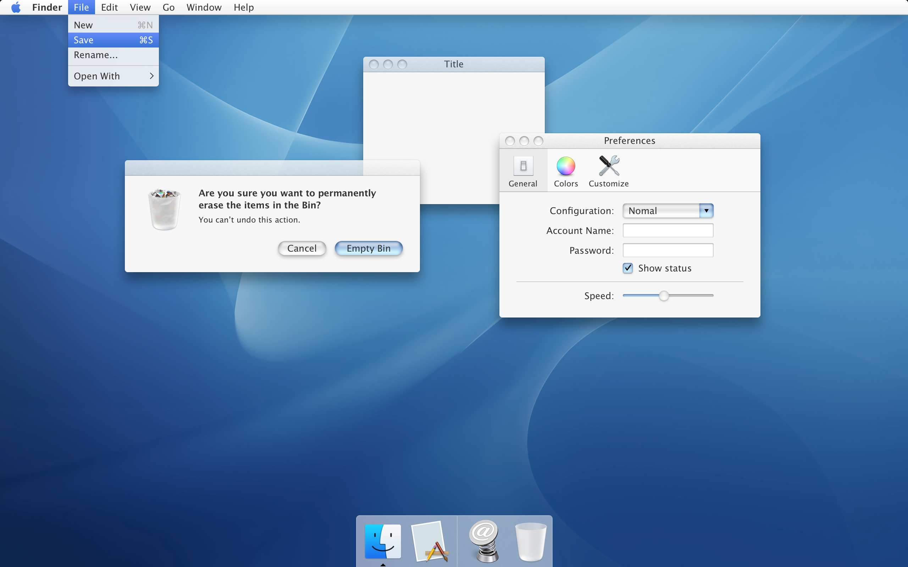

# Soft Aqua UI Kit

Soft Aqua is a UI design kit that hopes to represent the best of the Mac's skeuomorphic design history - from macOS Cheetah through macOS Mavericks. Soft Aqua is not an exact recreation of any one version of macOS, rather its goal is to reimagine what a modern skeuomorphic aqua interface could look like today. 

Named "Soft" Aqua because it borrows the soft shading effects from neomorphic design, forgoing the hard glossy highlights of Apple's original design.

## Why?

For fun and nostalgia, of course!

## Work to be Done

- Lists, scrollbars, etc.
- Progress bars, spinners, etc.
- Help button, stepper button, and other smaller buttons.
- Layout guides.